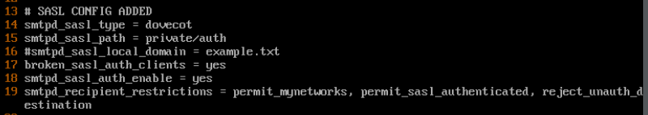

# Fedora 21 Mail Server

This server is the email server of the network. It's main services are SMTP (Postfix: Port 25) and POP3 (Dovecot: Port 110). SMTP is for receiving mail from the internet or local server and POP3 is for downloading new mail.

# Linux

All you are going to have during the competition is a basic TTY shell. There are no nice features like scrolling and you're stuck doing one thing at a time. Tmux is a great way to get around these limitations and make your life easier. Some beginning steps are listed [below](#tmux). If you have experience in Linux and want to skip the basics, you can go to the [fixes](#misc-fixes-that-helped-and-things-to-know) section.

## The Basics

These are the directories you should know off the top of your head:

- `/var/log`: Log files 
- `/etc`: Config files 
- `/usr`: User programs and data 
- `/home`: User's home directories

Here are some useful commands to help you get around:

- Reboot: `reboot` 
- Shutdown: `shutdown -h now` 
- Find files/dirs: `find / -type [d/f] -name [dir/file name]` 
- String search: `grep -rn '[base_path]' -e '[regex_string]'`

You can redirect the input/output of commands you run on the terminal:

- Write `stdout` to file: `<command> > <file>`
- Write `stderr` to file: `<command> 2> <file>`
- Append `stdout` to file: `<command> >> <file>`
- Append `stderr` to file: `<command> 2>> <file>`
- Push command `stdout` to other command's `stdin`: `<command> | <command>`

A good use of this is if the output of a command is too long for the screen, you can redirect it to `less`:

`<command> | less`

Are some commands too much to type? You can `alias` commands to custom commands. Here are some aliases I like to use:

- `alias c='clear'`
- `alias sdn='shutdown -h now'`
- `alias ports='lsof -i -P -n | grep LISTEN'`
- `alias services='systemctl list-units --type=service'`
- `alias users='getent passwd | cut -d: -f1`
- `alias ud='userdel -r'`
- `alias lsa='ls -lh'`
- `alias vi='vim'`
- `alias gb='cd ..'`

Put these in `~/.bashrc` and then use `source ~/.bashrc` to reload the shell.

## Text editor

Vi and nano come with the VM. Nano is very basic and good for most users. I like to download vim because the shortcuts make editing easier. Vim has a steeper learning curve however, so I say try both and see what you think. An annotated .vimrc file is included in this repo to illustrate some configs that make life easier in vim.

## Tmux

Here are some of the things you can do with tmux:

- Split the terminal horizontally: `Prefix-"`
- Split the terminal vertically: `Prefix-%`
- Create a new window: `Prefix-c`
- Scroll up and copy text from the terminal: `Prefix-[`
  - **NOTE:** The copy/paste in this mode only works inside of tmux, it does not copy to the system buffer
  - Paste is `Prefix-]`
- Zoom one window to fill screen (toggle): `Prefix-z`
- Close pane/window: `CTRL-d`
  - This is the shortcut to close any terminal

The `Prefix` defaults to `CTRL-b`  

An annotated example .tmux.conf file is included in this folder with some of the configs I like to use. Just put that file in your home directory before you start tmux and it will take effect.

## Journal

Journal is the log monitor that comes with Fedora. Here are the top 2 useful commands. 

- View full logs in a `less` like format: `journalctl -xe`
- View logs in real time. Keep this up to see active login checks: `journalctl -f`

# Misc Fixes that Helped and Things to Know

## Fixes

- Changed mynetworks around line 264 of `/etc/postfix/main.cf` to `mynetworks =127.0.0.0/24` 
- In `/etc/dovecot/conf.d/10-auth.conf`, authorization parameters around line 10 **must** be `disable_plaintext_auth=no` 
- In `/etc/dovecot/conf.d/10-master.conf`, changed service dict aroud lines 115-117 to: 
```
mode = 0600 
user = postfix 
group = postfix 
```
- Enable Postfix to authenticate users locally ([source](https://www.xmodulo.com/enable-user-authentication-postfix-smtp-server-sasl.html)):



## Random Knowledge

- Login banner (This is usually an inject in the competition): Put message in `/etc/motd` (Stands for Message of the Day)
- Add user to sudoers (In case your user loses sudo): `usermod -aG wheel <user>`
- Install NTP server (This is usually an inject in the competition):

```bash
yum install ntp 
systemctl enable ntpd 
systemctl start ntpd
```

# Recommended Areas to Research

**IPTables** proved very useful during last year's competition for blocking all but the required ports. Some research could be done to see if rate limiting can also be done through IPTable because the firewall didn't catch everything and the server was DOSed in the last 10 minutes. Writing a script for setting up these rules will also save time. Here are some links to start you off:

- [The Beginner’s Guide to iptables, the Linux Firewall](https://www.howtogeek.com/177621/the-beginners-guide-to-iptables-the-linux-firewall/) 
- [Linux Block Port With IPtables Command - nixCraft](https://www.cyberciti.biz/faq/iptables-block-port/)  
- [How to open Ports on Iptables in a Linux server | E2E Networks Knowledge base](https://www.e2enetworks.com/help/knowledge-base/how-to-open-ports-on-iptables-in-a-linux-server/) 
- [Per-IP rate limiting with iptables - Making Pusher](https://making.pusher.com/per-ip-rate-limiting-with-iptables/)
- https://www.digitalocean.com/community/tutorials/how-to-list-and-delete-iptables-firewall-rules 

**ClamAV** should help find any viruses on the machine. Sometimes this is also an inject. I have no notes on it's use.